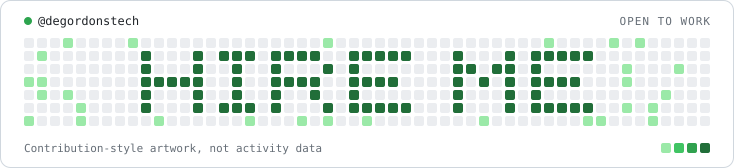

<h1 align="center">Godwin Danjuma</h1>

<strong>AI-native Solutions Architect &amp; System Builder</strong>

I design and ship complete production systems end to end: payments, chat automation, API integrations and full SaaS products. Comfortable owning the whole stack alone, and just as comfortable inside a team.

  <a href="https://degordons.xyz">Portfolio</a> · <a href="https://degordons.com">Studio</a> · <a href="https://x.com/degordons_">X</a> · <a href="mailto:hello@degordons.xyz">hello@degordons.xyz</a>

### `~/hire-me`

  <a href="https://degordons.xyz/contact">
    <picture>
      <source media="(prefers-color-scheme: dark)" srcset="art/hire-me-dark.svg">
      
    </picture>
  </a>

Decorative artwork, not contribution data. Open to remote contract or full-time work.

---

### Products

**[Sellnudge](https://sellnudge.com)** is an AI sales assistant for businesses that sell in chat. It answers customers on WhatsApp, Instagram, Facebook, Telegram and TikTok with real prices and stock, takes the order, collects payment straight to the seller's bank, and books the delivery. Live on Google Play.

`Next.js` · `Supabase` · `Meta APIs` · `Paystack` · `Shipbubble`

**[Nudge](https://creators.sellnudge.com)** is comment to DM for Instagram and Facebook, approved by Meta. Someone comments a keyword, they get the owner's message in seconds.

`Next.js` · `Supabase` · `Instagram and Facebook Graph APIs`

**[P2Proof](https://p2proof.vercel.app)** is profit and record keeping for P2P crypto traders on Bybit and Bitget: true profit after fees and bank-ready evidence, across 16 African countries.

`Next.js` · `TypeScript` · `Supabase` · `Telegram`

### Open source

| Project | What it does |
|---|---|
| [pwa2play](https://github.com/degordonstech/pwa2play) | Claude Code plugin that packages a PWA into a signed Play Store app |
| [serverless-audit](https://github.com/degordonstech/serverless-audit) | Claude Code plugin that finds code that works locally and breaks on serverless |
| [app-review](https://github.com/degordonstech/app-review) | Claude Code plugin that writes Meta, TikTok and Google Play review submissions from your code |
| [whatsapp-doctor](https://github.com/degordonstech/whatsapp-doctor) | CLI that diagnoses a WhatsApp Cloud API setup |

### Stack

